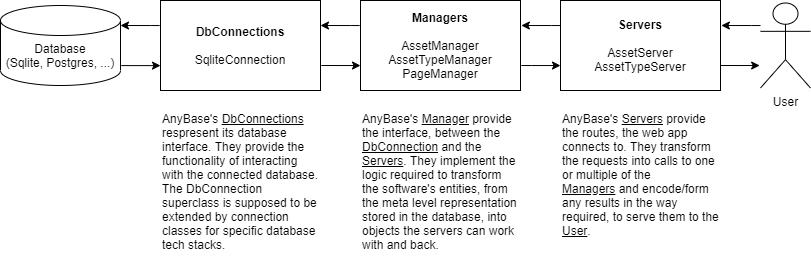

# Routes
This is a list of all the routes AnyBase uses. This should be kept up to date. So, when creating a new route or routeschema (Which should not be the case too often, I hope), it should be noted here, keeping to the notification used by the routes already registered.

## Concept
AnyBase is a webapp, so (rather obviously) it uses routes to do stuff. Basic information on [Quart]s Routes and  [HTTP], can be found in the supplied links. 

Right now, AnyBase does not use that many routes and I intend to keep it that way. The concept is very simple. AnyBase right now works with two _Servers_ (AssetTypeServer, AssetServer), which are nothing else, than wrappers, for a collection of functions, that are bound to routes using [Quart]. These bindings are created in the ``register_routes`` functions of the servers, which are called in the setup done in [main.py], before starting the app. Each Route has an url, a name, a function it calls and a HTTP-method it uses. The names should be unique so one can refer to a route's name, which then is equivalent to a function and an url. The urls are assigned and right now follow a simple scheme. They start with the entity they are concerned with. Which right now is either ``/asset`` or ``/asset-type``, either directly followed by an _action call_ ``(/list, /created, ..)``, or an id. The id specifies the entity we want to inspect. This results in urls like: 

```
GET /asset-type/list
GET /asset:5/delete
POST/asset-type:1/create
GET /asset-type/config
```
Not all urls are implementing more than one HTTP-method. The obvious goal is to keep the urls readable. 

[Quart] binds the urls to functions, so when a user requests a url, a python function is called. The function is expected to return a valid response or nothing. Refer to [Quart]'s documentation for further detail on the matter.
AnyBase servers are its outermost layer and provide an interface to AnyBase's managers. The managers in return supply an interface to the database, which is the innermost _layer_ of AnyBase.




[//]: # (LINKS)
[Quart]: https://github.com/pgjones/quart
[HTTP]: https://www.w3schools.com/whatis/whatis_http.asp
[main.py]: https://github.com/PDT420/AnyBase/blob/master/src/main.py 

[//]: # (IMAGES)